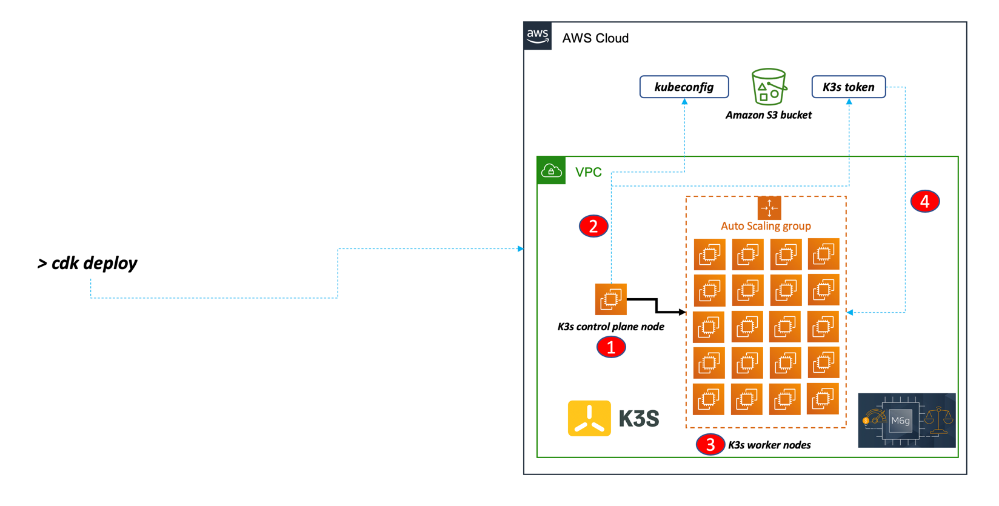
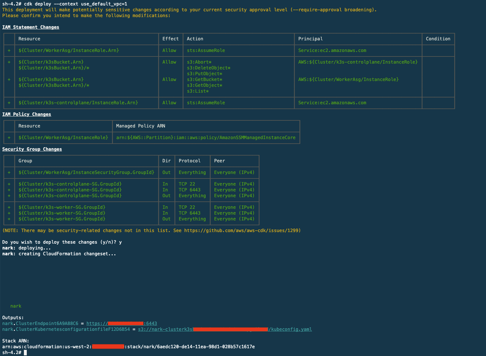

[](https://badge.fury.io/js/cdk-k3s-cluster)
[](https://badge.fury.io/py/cdk-k3s-cluster)


## What is cdk-k3s-cluster?

`cdk-k3s-cluster` is a new JSII construct library for AWS CDK that deploys a scalable Kubernetes [K3s](https://k3s.io/) cluster on **Graviton2 Arm-based** (mg6) **Spot** instances with one ~~click~~ command on AWS.


## What problem does cdk-k3s-cluster solve?

`cdk-k3s-cluster` is just another way to deploy Kubernetes (`K3s` specifically) on AWS. `K3s` is a minimalist Kubernetes distribution from Rancher often related to Edge and IoT use cases. There is a gazillion of articles on the Internet about how to setup `K3s` on a Raspberry cluster. The great [Alex Ellis](https://twitter.com/alexellisuk) has a [blog post](https://blog.alexellis.io/test-drive-k3s-on-raspberry-pi/) on it, for example. Since I don't have a Raspberry cluster and I was not planning to buy one I thought I'd use the power of the cloud to mimic it. The result of this experiment is that you could deploy an ephemeral, cheap Kubernetes Arm-based cluster on AWS in a matter of minutes. Unleash your imagination re how you can use it (e.g. an ephemeral cluster part of your deployment pipeline in the cloud?). Note the class today only supports Arm-based instances for deomstration purposes but can easily be adapted to support x86-based instances. 

## How do you deploy and consume cdk-k3s-cluster?

### The Cluster API 

The `Cluster` API available in the `cdk-k3s-cluster` library allows you to build the k3s cluster on AWS with AWS CDK. This library is currently available in both `NPM` and `PyPi`.

To create a default cluster: 

```ts
import * as k3s from 'cdk-k3s-cluster'

new k3s.Cluster(stack, 'Cluster')
```

See below for a complete example.

### Deployment  

`cdk-k3s-cluster` first deploys a Graviton2 EC2 instance (`m6g.large` by default) where it starts the `K3s` control plane. The `kubeconfig` file generated and the `K3s` token are copied to an S3 bucket. It then creates an ASG that spins up the number of Graviton2 worker nodes that you specify (3 by default - the ceiling limit is based on your account limits). These instances launch `K3s` worker nodes that join the cluster by downloading the token from S3. Ultimately the CDK outputs the link to the `kubeconfig` file on your private S3 bucket for you to copy it and use it with `kubectl`. This construct can deploy the worker node instances using either the `on-demand` or the `Spot` life cycles to reduce costs further (`Spot` is used by default). This construct cretes by default a new VPC but it can be configured to deploy either on the `default` VPC in your account or on a specific existing VPC id.            

This is a high level view of the architecture and the deployment flow described above: 


This is a screenshot of the cluster creation user experience using CDK: 



### Consumption  

Once the `cdk-k3s-cluster` has been deployed, this a high level view of the consumption flow:


This is an example of the cluster consumption user experience using the `aws cli` (used to copy the `kubeconfig` file from S3) and `kubectl`:

```
sh-4.2# aws s3 cp s3://k3sCluster-clusterk3sbucketxxxxxxxxxxxxx/kubeconfig.yaml .                                                                                                                     
download: s3://k3sCluster-clusterk3sbucketxxxxxxxxxxxxx/kubeconfig.yaml to ./kubeconfig.yaml

sh-4.2# kubectl get nodes --kubeconfig=./kubeconfig.yaml 
NAME                                          STATUS   ROLES    AGE     VERSION
ip-172-31-43-198.us-west-2.compute.internal   Ready    master   2m49s   v1.16.9+k3s1
ip-172-31-10-252.us-west-2.compute.internal   Ready    <none>   15s     v1.16.13+k3s1
ip-172-31-18-126.us-west-2.compute.internal   Ready    <none>   8s      v1.16.13+k3s1
ip-172-31-60-174.us-west-2.compute.internal   Ready    <none>   1s      v1.16.13+k3s1
```

### How does this relate to EKS 

It doesn't. As noted above, `cdk-k3s-cluster` is just yet another experimental and peculiar way to run Kubernetes on AWS.


## What are the running costs for a cluster built with cdk-k3s-cluster?

It obviously depends how many worker nodes you deploy. If we stick to all the defaults (`Spot` lifecycle and the `m6g.medium` instance type with 1 Graviton2 CPU and 4GB of memory), as of August 2020 the unit cost in `Oregon` is $0.0177 which translates to a unit cost of $0.1416 per 8 hours (a work day). A 3 worker nodes cluster would be $0.5664 (including the control plane) per 8 hours (or $1.6992 per 24 hours full day). 

A *100 worker nodes cluster* (or 101 vCPUs and 404GB of memory) would be *$0.0177 x 101 = $1.7877 per hour* or $0.0177 x 101 x 24 = *$42.9048 per day*. 

This does not include, for example, the costs of the S3 bucket (probably marginal) or network traffic. 


## Getting started

`cdk-k3s-cluster` is available in both `NPM` and `PyPi` modules ready to be imported into your CDK program. 

### I am a Typescript type of person 

This is an example of how to consume the `NPM` module with a CDK application written in Typescript. If you need to setup your Typescript environment [this is a good guide](https://docs.aws.amazon.com/cdk/latest/guide/work-with-cdk-typescript.html).

```
$ mkdir myk3scluster-typescript
$ cd myk3scluster-typescript
# initialize the AWS CDK project
$ cdk init -l typescript
# install the cdk-k3s-cluster npm module
$ yarn add cdk-k3s-cluster
```

Update your `./bin/myk3scluster-typescript.ts` file with the following content. Note how, in this example, we are using all of the properties available today:

```
import * as cdk from '@aws-cdk/core';
import * as ec2 from '@aws-cdk/aws-ec2';
import * as k3s from 'cdk-k3s-cluster';

const app = new cdk.App();

const env = {
  region: app.node.tryGetContext('region') || process.env.CDK_INTEG_REGION || process.env.CDK_DEFAULT_REGION,
  account: app.node.tryGetContext('account') || process.env.CDK_INTEG_ACCOUNT || process.env.CDK_DEFAULT_ACCOUNT
};

const stack = new cdk.Stack(app, 'k8sCluster', { env })

new k3s.Cluster(stack, 'Cluster', {
  vpc: k3s.VpcProvider.getOrCreate(stack),
  spotWorkerNodes: true,
  workerMinCapacity: 3,
  workerInstanceType: new ec2.InstanceType('m6g.medium'),
  controlPlaneInstanceType: new ec2.InstanceType('m6g.medium')
})
```

### I am a Python type of person 

This is an example of how to consume the `PyPi` module with a CDK application written in Typescript. If you need to setup your Python environment [this is a good guide](https://docs.aws.amazon.com/cdk/latest/guide/work-with-cdk-python.html).

```
$ mkdir myk3scluster-python
$ cd myk3scluster-python
# initialize the AWS CDK project
$ cdk init -l python
# activate the Python virtual environment
$ source .env/bin/activate
# install the dependencies
$ pip install cdk-k3s-cluster
```

Update your `./app.py` file with the following content. Note how, in this example, we are only using two of the parameters available. To use all the defaults you could use `cluster = k3s.Cluster(self, "MyK3sClusters")`: 

```
#!/usr/bin/env python3

from aws_cdk import core
import cdk_k3s_cluster as k3s

class K3sCluster(core.Stack):    
    def __init__(self, scope: core.Construct, id: str, **kwargs):
        super().__init__(scope, id, **kwargs)
        k3s.Cluster(self, "MyK3sClusters", worker_min_capacity=5, spot_worker_nodes=True) 

app = core.App()
K3sCluster(app, "K3sCluster") 
app.synth()
```


### Deploying the stack (regardless of the language you have used) 

deploy the CDK stack:

```
# see the difference before the deployment
$ cdk diff
# deploy it
$ cdk deploy
```

If you want to deploy in an existing VPC use either `cdk deploy --context use_default_vpc=1` or `cdk deploy --context use_vpc_id=<vpc id>`

### Clean up 

Cleaning up the environment is as easy as running `cdk destroy` from where you left your prompt. 

## Known issues and limitations

* First and foremost this is a learning experiment. I have done limited tests with it. 

* Frankly I have not tested this beyond a mere `kubectl get nodes` test. Let alone trying anything like [arkade](https://github.com/alexellis/arkade) 

* I have only tested this in `us-west-2`. It should work in other regions too but I haven't tried 

* The two options you have for instances are `m6g.medium` and `m6g.large`. If you want to add another instance choice you probably need to add/tweak the PriceMap in `cdk-stack.ts`. I have not tested it 

* `cdk-k3s-cluster` only deploys Arm-based instances. It would be trivial to add x86 based instances support but it's not there today 

* When you destroy the stack the S3 bucket will be left undeleted. This is by design and you need to delete manually.

* All the control plane and worker nodes are deployed in public subnets and the SGs are fairly permissive in terms of "source". Picking private subnets would have probably broken the use case of deploying into the `default` VPC (which is handy). This prototype over-indexes more on deployment convenience and ease of use than on best practices. 

* The control plane instance always deploys `on-demand` while for worker nodes you can pick between `on-demand` and `Spot`

* The ASG for worker nodes is configured with a single parameter that becomes the `min`, `max` and `desired` count for the ASG

* For simplicity, both the control plane instance and the worker nodes share the same instance type  


## Credits 

This library has been authored by [Massimo](https://github.com/mreferre/) and [Pahud](https://github.com/pahud/). 
